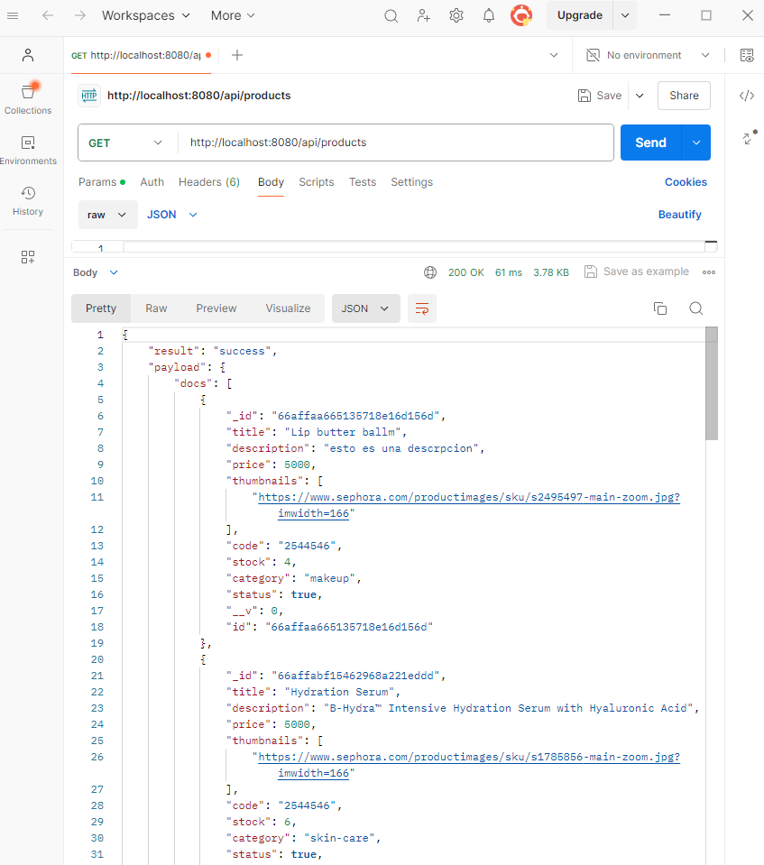
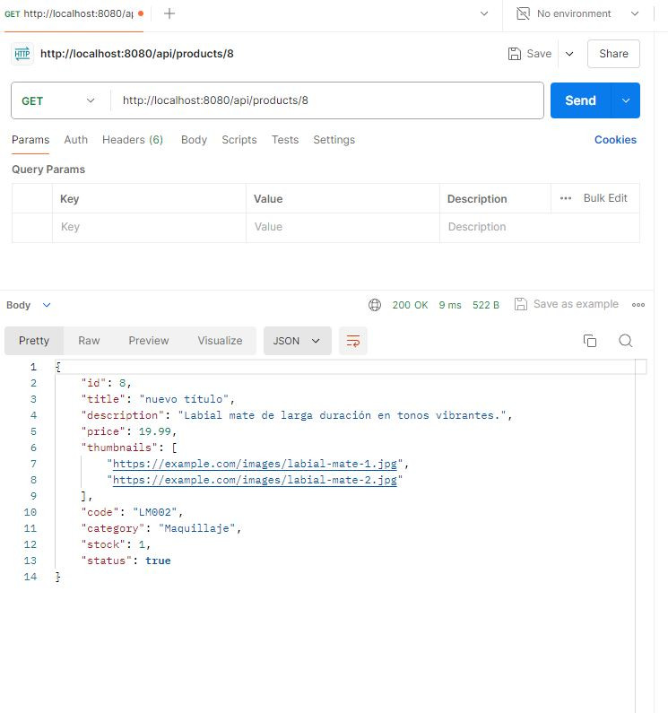
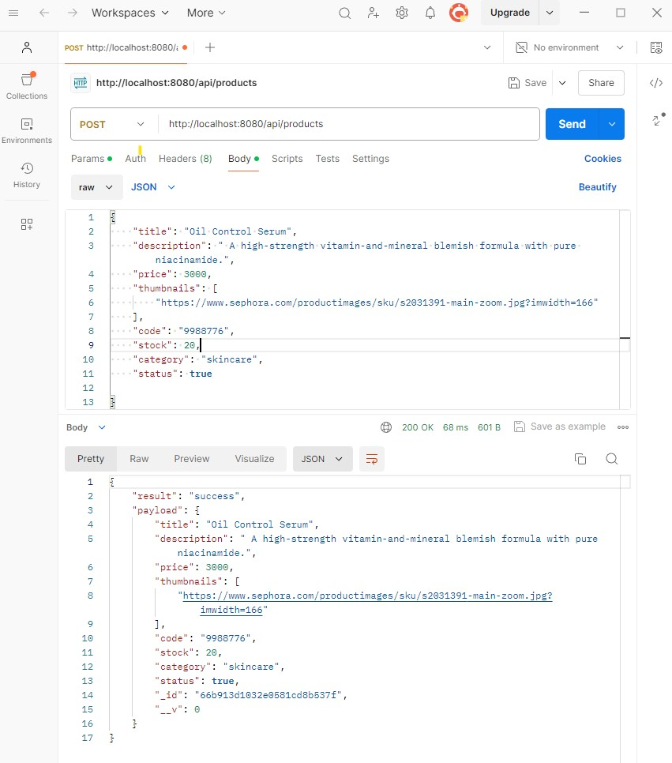
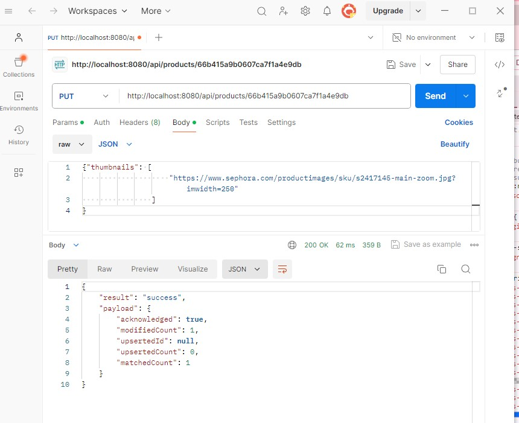
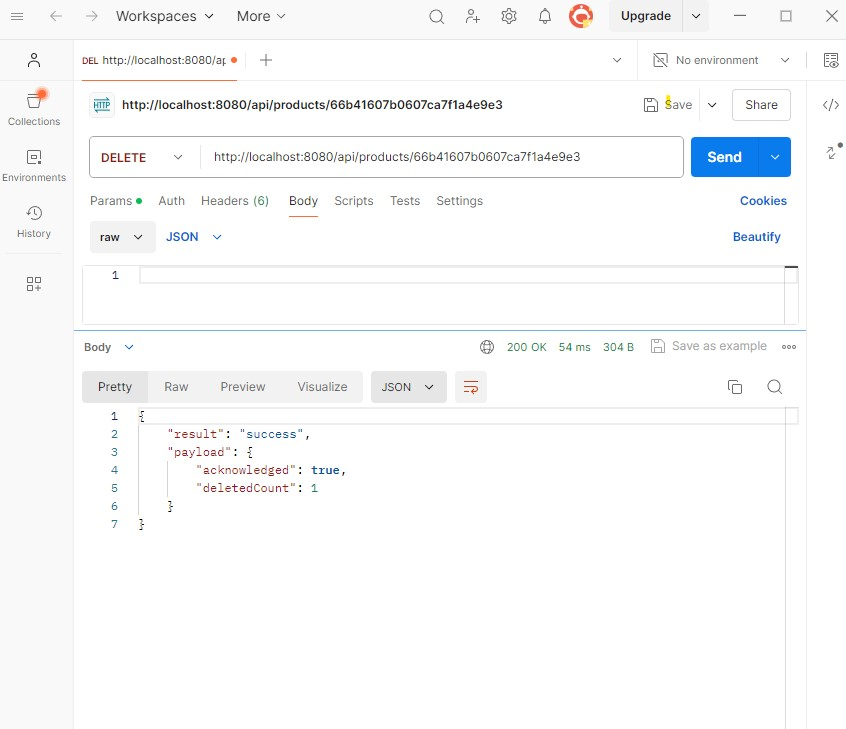
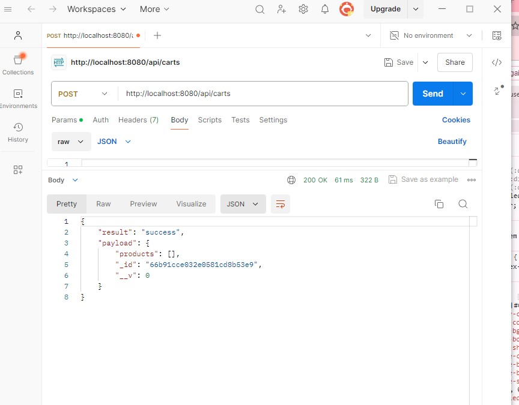
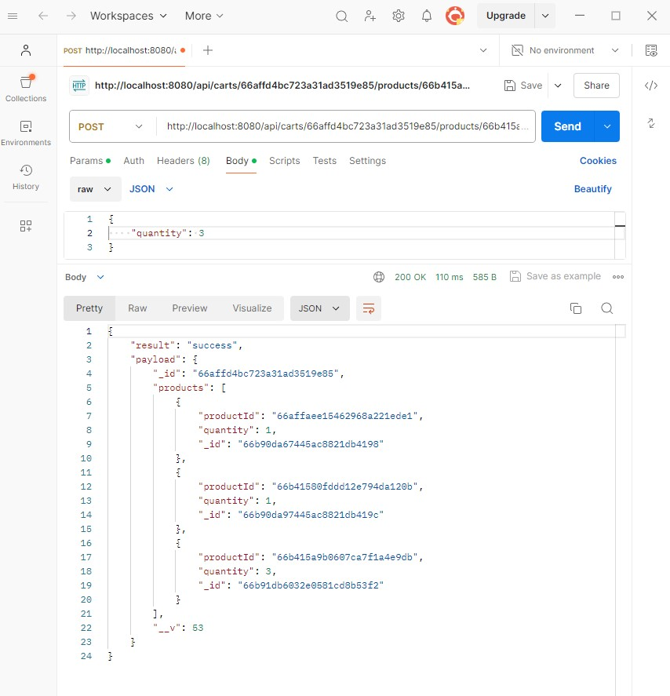
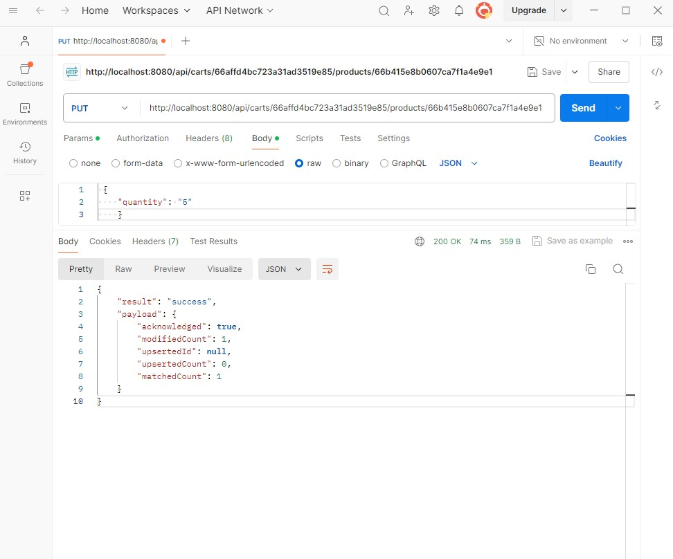
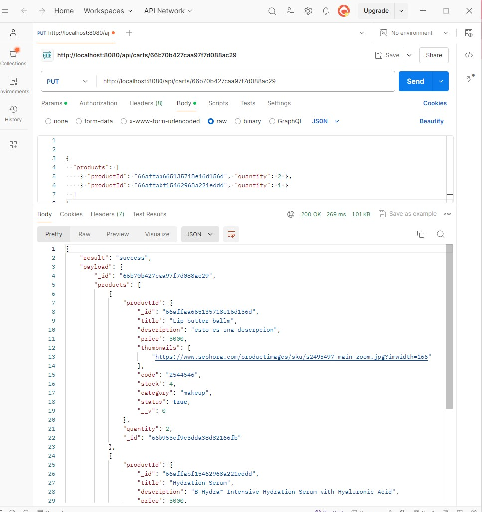

# Proyecto Backend de E-commerce

Este proyecto es una implementación backend para una plataforma de comercio electrónico construida con Node.js, Express y MongoDB. El mismo fue realizado en el marco del curso de Backend de Coderhouse, y cumple los requerimientos de la Entrega Final del tramo II.


## Información del Proyecto

- ### Nombre:  
   proyecto-backend-2

- ### Autora:
   Micaela Grandoso
   

- ### Características:
  - Autenticación y autorización de usuarios (JWT).
  - Gestión de productos (listado, creación, eliminación y actualización).
  - Funcionalidad de carrito de compras (crear, obtener, eliminar, actualizar).
  - Procesar pedidos: crear ticket de compra y enviar por correo electrónico al cliente.
  - Manejo de inventario: restar stock de la database cuando se realiza una venta.


- ### Tecnologías utilizadas:
  - Node.js
  - Express.js
  - Handlebars.
  - Sweet Alert.
  - Persistencia: Mongo Db Atlas.
  - Mongoose.
  - Mongoose-paginate-v2.
  - Bootstrap.
  - Passport.js.
  - Passport-jwt
  - Bcrypt.
  - Jsonwebtoken.
  - Cookie-parser
  - Dotenv
  - Uuid
  - Nodemailer


## Instalación

1. Clona este repositorio.
2. Navega al directorio del proyecto.
3. Instala las dependencias con `npm install`.
4. Crea un archivo `.env` en el directorio raíz con las variables de entorno (ver `.env.example`).

## Uso

El servidor se iniciará en el puerto especificado en tu archivo .env o caso contrario en el 8080.
Para ejecutar la aplicación:

```bash
npm start

```


## Endpoints de la API 

- `/api/products` - Operaciones relacionadas con productos
- `/api/carts` - Operaciones del carrito de compras
- `/api/sessions` - Autenticación de usuarios y gestión de sesiones
- `/api/users` - Gestión de usuarios


### PRODUCTS

**GET:**

- **Obtener todos los productos:**
  - URL: `http://localhost:3000/api/products`
  - No requiere autenticación.
- **Parámetros de consulta opcionales: limit, page, sort, category, status**
    -Page (si no se proporciona un valor, se otorga la page 1).
     URL: `http://localhost:3000/api/products?page=2`
    - Limit (si no se proporciona, por default es 10):
     URL:`http://localhost:3000/api/products?limit=4`
    - Sort. Opciones: asc y desc
     URL `http://localhost:3000/api/products?sort=asc`
    - Filter category, debe recibir nombre de categoría, por ejemplo, haircare.
    URL:`http://localhost:3000/api/products?category=haircare`
    - Filter status, recibe true o false que se convierte a boolean y filtra de acuerdo a la propiedad "status" del producto.
    URL:`http://localhost:3000/api/products?status=false`
    - Múltiples params:
    URL: `http://localhost:3000/api/products?limit=5&category=makeup&status=true&sort=asc&page=2`

- **Obtener un producto por su ID:**
- No requiere autenticación
  - URL: `http://localhost:3000/api/products/:pid`
  - Ejemplo: `http://localhost:3000/api/products/66affad715462968a221eddf`

**POST:**

- **Crear un nuevo producto:**
  - Requiere autenticación con rol de admin
  - URL: `http://localhost:3000/api/products`
  - Ejemplo de Body (JSON):
    
```json
{
    "title": "Hydrating Moisturizer",
    "description": "A deeply nourishing moisturizer with hyaluronic acid for intense hydration.",
    "price": 4500,
    "thumbnails": [
        "https://www.sephora.com/productimages/sku/s2742369-main-zoom.jpg?pb=clean-planet-aware&imwidth=250"
    ],
    "code": "1122334",
    "stock": 15,
    "category": "skincare",
    "status": true
}

```

**PUT:**

- **Actualizar un producto por su ID:**
  - Requiere autenticación con rol de admin
  - URL: `http://localhost:3000/api/products/:pid`
  - Body (JSON) con campos permitidos: `stock`, `description`, `price`, `category`, `thumbnails`,  `title`, `code`, `status`.
  - Ejemplo: `http://localhost:3000/api/products/66affad715462968a221eddf`
    ```json
    {
  
      "description": "Está descripción ha sido actualizada"
    }
    ```

**DELETE:**

- **Eliminar un producto por su ID:**
  - Requiere autenticación con rol de admin
  - URL: `http://localhost:3000/api/products/:pid`
  - Ejemplo: `http://localhost:3000/api/products/66affad715462968a221eddf`


### CARTS


**GET:**

- **Obtener un carrito por su ID:**
  - Requiere autenticación con rol de user.
  - URL: `http://localhost:3000/api/carts/:cid`
  - Ejemplo: `http://localhost:3000/api/carts/66e8c65e399279f48f0bd982`
  - Lista todos los productos contenidos en el carrito especificado y realiza populate para traer las propiedades de cada producto.

  **Obtener el cart del user autenticado**
  - Requiere autenticación con rol de user.
  - URL: `http://localhost:3000/api/carts/`
  -Devuelve el carrito asociado al cartId del usuario autenticado, extraído del token JWT.

**POST:**

- **Crear un nuevo carrito vacío:**
  - Requiere autenticación con rol de user.
  - URL: `http://localhost:3000/api/carts`
  - Crea un carrito nuevo con una estructura inicial vacía. Este cart no estaría asociado a ningún user, por lo que este endpoint ya no tendría sentido, pero se deja para pruebas. El result es:
  ```json
  {
    "result": "success",
    "payload": {
        "products": [],
        "_id": "66b91cce032e0581cd8b53e9",
        "__v": 0
    }
    }
    ```

**POST (Agregar producto al carrito):**

- **Agregar un producto al carrito por IDs:**
  - Requiere autenticación con rol de user.
  - URL: `http://localhost:3000/api/carts/:cid/products/:pid`
  - Ejemplo: `http://localhost:3000/api/carts/66e8c65e399279f48f0bd982/products/66b415a9b0607ca7f1a4e9db`
  - La quantity se puede pasar por body:
  ```json
  {
    "quantity": "3"
    }
    ```
Si no se pasa nada por body, la quantity será 1 por default.

- **Completar compra:**
  - Requiere autenticación con rol de user.
  -Completa la compra del carrito.
  - URL: `http://localhost:3000/api/carts/:cid/purchase`
  - Ejemplo: `http://localhost:3000/api/carts/66e8c65e399279f48f0bd982/purchase`
   Quita del stock de la database la cantidad comprada. En la respuesta devuelve los productos que no pudieron comprarse por falta de stock y los deja en el carrito.
    ```json
  {
    "result": "success",
    "message": "Purchase completed",
    "productsNotPurchased": [
        {
            "productId": {
                "_id": "66b7f065149c54e3aee92f42",
                "title": "Eyelash Curler",
                "description": "Rizador de pestañas ergonómico y fácil de usar.",
                "price": 1800,
                "thumbnails": [
                    "https://www.sephora.com/productimages/sku/s1201474-main-zoom.jpg?pb=2020-03-allure-best-2018&imwidth=250"
                ],
                "code": "7890123",
                "stock": 0,
                "category": "tools",
                "status": false,
                "__v": 0
            },
            "quantity": 1,
            "_id": "67156b6816034ea1dcd3f0dc"
        }
    ]
    }
    ```

**PUT:**

- **actualizar la cantidad de un producto determinado:**
  - Requiere autenticación con rol de user.
  - URL: `http://localhost:3000/carts/:cid/products/:pid`
  - Ejemplo: `http://localhost:3000/api/carts/66affd4bc723a31ad3519e85/products/66b415c5b0607ca7f1a4e9dd`
  - Actualiza la cantidad de un producto determinado que ya se encuentra en el carrito.
  La quantity se debe pasar por BODY:
    ```json
  {
    "quantity": 2
    }
    ```
  
- **actualizar el carrito con un arreglo de productos:**
  - Requiere autenticación con rol de user.
  - URL: `http://localhost:3000/api/carts/:cid`
  - Ejemplo: `http://localhost:3000/api/carts/66affd4bc723a31ad3519e85`
  - Actualiza el carrito con un arreglo de productos.
  El array de products se envía por body. La solicitud debe tener este formato:
  
  ```json
   {
  "products": [
    { "productId": "66b415d4b0607ca7f1a4e9df", "quantity": 2 },
    { "productId": "66b415e8b0607ca7f1a4e9e1", "quantity": 1 }
  ]
  }

    ```

**DELETE:**

- **Elimina producto seleccionado del carrito:**
  - Requiere autenticación con rol de user.
  - URL: `http://localhost:3000/api/carts/:cid/products/:pid`
  - Ejemplo: `http://localhost:3000/api/carts/66affd4bc723a31ad3519e85/products/66b415c5b0607ca7f1a4e9dd`
  - Elimina del cart pasado por param el producto pasado por param.

- **Vacía el cart del id seleccionado:**
  - Requiere autenticación con rol de user.
  - URL: `http://localhost:3000/api/carts/:cid`
  - Ejemplo: `http://localhost:3000/api/carts/66affd4bc723a31ad3519e85`
  - Vacía el cart especificado con id por params, en este caso, 66affd4bc723a31ad3519e85


### USERS

**GET:**

- **Obtener todos los usuarios:**
- URL: `http://localhost:3000/api/users`

- **Obtener un usuario por id:**
- URL: `http://localhost:3000/api/users/:uid`
- Ejemplo: `http://localhost:3000/api/users/66e8c65e399279f48f0bd984`


**PUT:**
- **Actualizar un usuario por id:**
- URL: `http://localhost:3000/api/users/:uid`
- Ejemplo: `http://localhost:3000/api/users/66e8c65e399279f48f0bd984`
- En el cuerpo de la solicitud, se debe enviar el objeto con los datos a actualizar.
- Ejemplo:

  ```json
   {
   "age": 37
  }

    ```

**DELETE:**
- **Eliminar un usuario por id:**
- URL: `http://localhost:3000/api/users/:uid`
- Ejemplo: `http://localhost:3000/api/users/66ea22763da68cdc96e2229a`


### SESSIONS

**POST:**

- **Login:**
- URL: `http://localhost:3000/api/sessions/login`
- En el cuerpo de la solicitud, se debe enviar el objeto con los datos de login (email y password)
 ```json
{
    "email": "mica@mail.com",
    "password": "mica1234"
}
 ```
- Si el login es exitoso, se devuelve:
```json
{
    "message": "Login successful"
}
```

- **Register:**
- URL: `http://localhost:3000/api/sessions/register`
- En el cuerpo de la solicitud, se debe enviar el objeto con los datos del usuario a crear
 ```json
{
   {
    "first_name": "coder",
    "last_name": "admin",
    "email": "coderadmin@mail.com",
    "age": 36,
    "password": "coder1234",
    "role": "admin"
}
}
 ```
- Si el registro es exitoso, se devuelve:

```json
{
    "message": "Register successful"
}
```


- **Logout:**
- URL: `http://localhost:3000/api/sessions/logout`
- Respuesta:

 ```json
{
    "message": "Logout successful"
}
 ```


## Vistas

LAS VISTAS NO ESTÁN REFACTORIZADAS NI MEJORADAS. FALTA TRABAJAR EN ESTE ASPECTO.

### CART

- **Visualizar el cart del user que se encuentra logueado**
- Sólo disponible para usuarios con rol user.
- URL: `http://localhost:3000/cart`
En esta vista se pueden ver los productos agregados y eliminarlos del carrito mediante un botón.
Si no se encuentra un jwt o el mismo expiró (no se reconoce el user logueado), arroja un error 401 y renderiza una vista para que el usuario pueda registrarse o iniciar sesión.

### PROFILE

- **Visualizar el perfil del user que se encuentra logueado**
- URL: `http://localhost:3000/profile`
En esta vista se puede ver el perfil del usuario logueado, incluyendo su información de registro (excepto datos sensibles).
También cuenta con un botón funcional para cerrar sesión (al cerrar sesión redirige a la vista login)
Si no se encuentra un jwt o el mismo expiró (no se reconoce el user logueado), arroja un error 401 y renderiza una vista para que el usuario pueda registrarse o iniciar sesión.

### LOGIN
- **Iniciar sesión en la aplicación**
- URL: `http://localhost:3000/login`
En esta vista se puede iniciar sesión con un usuario existente.

### REGISTER
- **Registrarse en la aplicación**
- URL: `http://localhost:3000/register`
En esta vista puede registrarse un nuevo usuario.


### PRODUCTS

- **Navegar a la lista de productos (catálogo):**
- URL: `http://localhost:3000/products`
- Muestra una lista de todos los productos disponibles.
  Cuenta con un botón de agregar al carrito, que agrega 1 unidad del producto.
  Por el momento no se implementó la vista de los detalles de cada producto.
- Mediante un form con opciones desplegables para seleccionar, permite filtrar por category,  status (true o false), ordenar por precio asc o desc y elegir cuantros resultados mostrar por página. IMPORTANTE: LOS FILTROS NO TIENEN "PERSISTENCIA" CUANDO SE HACE CLICK EN APPLY FILTERS, NAVEGA HACIA LA URL DEFINIDA MEDIANTE QUERY PARAMS, Y SI SE HACE UNA MODIFICACIÓN EN UN FILTRO, LA URL SE GENERA DE CERO.
  - Filtro category, debe seleccionar nombre de categoría, por ejemplo, makeup, y hacer click en el botón "apply filters". Esto genera esta url:
    URL:`http://localhost:3000/products?category=makeup&limit=10`
  - Filtro availability, debe seleccionar "in stock" (true) o "out of stock" (false), filtrando de acuerdo a la propiedad "status" del producto.Esto genera esta url:
    URL:`http://localhost:3000/products?status=true&limit=10`
  - Sort by: Debe seleccionar Default (sin orden), Price: low to high (asc) o Price: High to low (desc). Esto genera esta url:
    URL:`http://localhost:3000/products?sort=asc&limit=10`
  - Show, para hacer un limit en la cantidad de items por página (por default es 10). Se puede seleccionar del menú "5" o "20", o cambiarlo en la url.
    URL:`http://localhost:3000/products?limit=5`
  - Page: No se creó botón para seleccionar, pero puede cambiarse en la url. Si no se proporciona, por default  es 1.
    URL:`http://localhost:3000/products?page=3`
  - Aplicando múltiples query params. Por ejemplo, aplicamos category=makeup, status=true, sort=desc, limit=5, page=2
    URL: `http://localhost:3000/products?page=2&category=makeup&status=true&sort=desc&limit=5`
- **Los productos pueden agregarse al cart del usuario autenticado.**


### MANAGE PRODUCTS
- **Un formulario que permite agregar y eliminar productos del catálogo**
- Sólo disponible para rol admin.
- URL: `http://localhost:3000/manageproducts`
- FALTA MOSTRAR EL LISTADO DE PRODUCTOS, PARA QUE SEA MAS FACIL ELIMINARLOS SIN TENER QUE CONOCER EL ID.


## Capturas de ejemplos de uso con Postman
### Obtener todos los productos



### Obtener un producto por su ID



### Crear un nuevo producto



### Actualizar un producto por su ID



### Eliminar un producto por su ID



### Crear un nuevo carrito



### Agregar un producto al carrito por id



### Obtener un carrito por su ID


### Actualizar la quantity de un producto en un carrito



### Actualizar un cart específico con un array de productos 



### Eliminar un producto del cart por id


### Vacía el cart especificado por id


 

