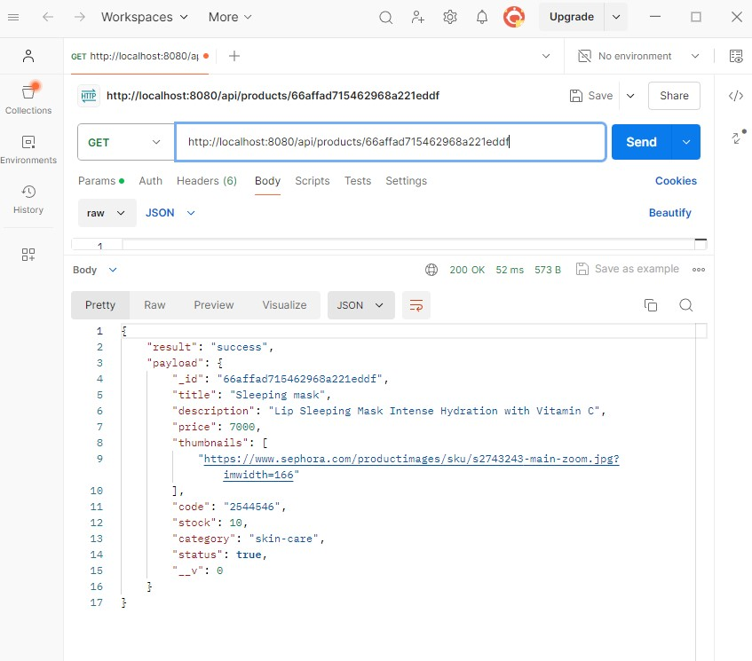
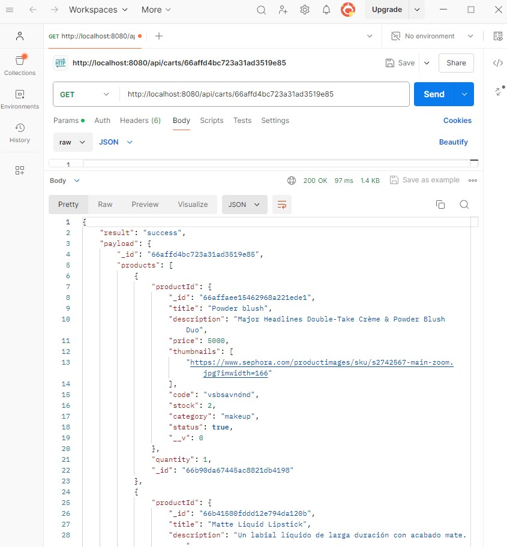

# Proyecto Backend Coderhouse

Esta app es el proyecto del curso de Backend I de Coderhouse. En esta ocasión se encuentra actualizada con los requerimientos de la Preentrega N° 3.

## Información del Proyecto

- ### Nombre:  
   proyecto-backend-grandoso

- ### Autora:
   Micaela Grandoso
   
- ### Descripción:

  Es una aplicación desarrollada en Node.js utilizando el framework Express, diseñada para gestionar productos y carritos mediante el uso de persistencia en Mongo Db Atlas. Permite realizar operaciones CRUD (Crear, Leer, Actualizar, Eliminar) sobre productos almacenados en la database y también gestionar carritos de compra.
  

- ### Características:
  - Eliminar y agregar productos del catálogo y ver la vista en tiempo real.
  - Crear, obtener, actualizar y eliminar productos del catálogo.
  - Crear carritos de compra.
  - Agregar productos a los carritos existentes.
  - Obtener el contenido de los carritos.
  - Eliminar productos de los carritos.
  - Vistas:
   Cuenta con vistas desarrolladas con handlebars. Las mismas permiten navegar hacia el catálogo de products y vista de cart. 
  <p style="color:red;">IMPORTANTE: Por el momento la id del cart al que se agregan los products está hardcodeada, hasta tanto se implemente sessions y users.</p> 
   Se conserva la vista de Realtimeproducts de la entrega anterior, que mediante Socket.IO, permite al usuario agregar y quitar productos del catálogo de productos y ver cómo el catálogo se actualiza en tiempo real.

- ### Tecnologías utilizadas:
  - Node.js
  - Express.js
  - Handlebars.
  - Socket.IO.
  - Sweet Alert.
  - Persistencia: Mongo Db Atlas.
  - Mongoose.
  - Mongoose-paginate-v2.
  - Bootstrap.


## Instalación

1. Clona este repositorio.
2. Instala las dependencias con `npm install`.

## Uso

Para ejecutar la aplicación:

```bash
npm start

```


## Endpoints API 

### PRODUCTS

**GET:**

- **Obtener todos los productos:**
  - URL: `http://localhost:8080/api/products`

- **Filtros opcionales, a solicitar mediante query:**
    -Page (si no se proporciona un valor, se otorga la page 1).
     URL: `http://localhost:8080/api/products?page=2`
    - Limit (si no se proporciona, por default es 10):
     URL:`http://localhost:8080/api/products?limit=4`
    - Sort. Opciones: asc y desc
     URL `http://localhost:8080/api/products?sort=asc`
    - Filter category, debe recibir nombre de categoría, por ejemplo, haircare.
    URL:`http://localhost:8080/api/products?category=haircare`
    - Filter status, recibe true o false que se convierte a boolean y filtra de acuerdo a la propiedad "status" del producto.
    URL:`http://localhost:8080/api/products?status=false`
    - Múltiples params:
    URL: `http://localhost:8080/api/products?sort=asc&status=true&page=2&limit=4`
     URL: `http://localhost:8080/api/products?limit=5&category=makeup&status=true&sort=asc&page=2`

- **Obtener un producto por su ID:**
  - URL: `http://localhost:8080/api/products/:pid`
  - Ejemplo: `http://localhost:8080/api/products/66b41580fddd12e794da120b`

**POST:**

- **Crear un nuevo producto:**
  - URL: `http://localhost:8080/api/products`
  - Ejemplo de Body (JSON):
    
```json
{
    "title": "Oil Control Serum",
    "description": " A high-strength vitamin-and-mineral blemish formula with pure niacinamide.",
    "price": 3000,
    "thumbnails": [
        "https://www.sephora.com/productimages/sku/s2031391-main-zoom.jpg?imwidth=166"
    ],
    "code": "9988776",
    "stock": 20,
    "category": "skincare",
    "status": true

}
```


**PUT:**

- **Actualizar un producto por su ID:**
  - URL: `http://localhost:8080/api/products/:pid`
  - Body (JSON) con campos permitidos: `stock`, `description`, `price`, `category`, `thumbnails`,  `title`, `code`, `status`.
  - Ejemplo: `http://localhost:8080/api/products/66affabf15462968a221eddd`
    ```json
    {
  
      "description": "Está descripción ha sido actualizada"
    }
    ```

**DELETE:**

- **Eliminar un producto por su ID:**
  - URL: `http://localhost:8080/api/products/:pid`
  - Ejemplo: `http://localhost:8080/api/products/66affabf15462968a221eddd`

### CARTS

**GET:**

- **Obtener un carrito por su ID:**
  - URL: `http://localhost:8080/api/carts/:cid`
  - Ejemplo: `http://localhost:8080/api/carts/66affd4bc723a31ad3519e85`
  - Lista todos los productos contenidos en el carrito especificado y realiza populate para traer las propiedades de cada producto.

**POST:**

- **Crear un nuevo carrito vacío:**
  - URL: `http://localhost:8080/api/carts`
  - Crea un carrito nuevo con una estructura inicial vacía. El result es:
  ```json
  {
    "result": "success",
    "payload": {
        "products": [],
        "_id": "66b91cce032e0581cd8b53e9",
        "__v": 0
    }
    }
    ```

**POST (Agregar producto al carrito):**

- **Agregar un producto al carrito por IDs:**
  - URL: `http://localhost:8080/api/carts/:cid/products/:pid`
  - Ejemplo: `http://localhost:8080/api/carts/66affd4bc723a31ad3519e85/products/66b415a9b0607ca7f1a4e9db`
  - La quantity se puede pasar por body:
  ```json
  {
    "quantity": "3"
    }
    ```
Si no se pasa nada por body, la quantity será 1 por default.

**GET:**

- **Obtener un carrito por su ID:**
  - URL: `http://localhost:8080/api/carts/:cid`
  - Ejemplo: `http://localhost:8080/api/carts/66affd4bc723a31ad3519e85`
  - Lista todos los productos contenidos en el carrito especificado y realiza populate para traer las propiedades de cada producto.

**PUT:**

- **actualizar la cantidad de un producto determinado:**
  - URL: `http://localhost:8080/carts/:cid/products/:pid`
  - Ejemplo: `http://localhost:8080/api/carts/66affd4bc723a31ad3519e85/products/66affad715462968a221eddf`
  - Actualiza la cantidad de un producto determinado que ya se encuentra en el carrito.
  La quantity se debe pasar por BODY:
    ```json
  {
    "quantity": "6"
    }
    ```
  
- **actualizar el carrito con un arreglo de productos:**
  - URL: `http://localhost:8080/api/carts/:cid`
  - Ejemplo: `http://localhost:8080/api/carts/66affd4bc723a31ad3519e85`
  - Actualiza el carrito con un arreglo de productos.
  El array de products se envía por body. La solicitud debe tener este formato:
  
  ```json
   {
  "products": [
    { "productId": "66b415d4b0607ca7f1a4e9df", "quantity": 2 },
    { "productId": "66b415e8b0607ca7f1a4e9e1", "quantity": 1 }
  ]
  }

    ```

**DELETE:**

- **Elimina producto seleccionado del carrito:**
  - URL: `http://localhost:8080/api/carts/:cid/products/:pid`
  - Ejemplo: `http://localhost:8080/api/carts/66affd4bc723a31ad3519e85/products/66b415a9b0607ca7f1a4e9db`
  - Elimina del cart pasado por param el producto pasado por param.

- **Vacía el cart del id seleccionado:**
  - URL: `http://localhost:8080/api/carts/:cid`
  - Ejemplo: `http://localhost:8080/api/carts/66affd4bc723a31ad3519e85`
  - Vacía el cart especificado con id por params, en este caso, 66affd4bc723a31ad3519e85

## Vistas

### PRODUCTS

- **Navegar a la lista de productos (catálogo):**
- URL: `http://localhost:8080/products`
- Muestra una lista de todos los productos disponibles.
  Cuenta con un botón de agregar al carrito, que agrega 1 unidad del producto.
  Por el momento no se implementó la vista de los detalles de cada producto.
- Mediante un form con opciones desplegables para seleccionar, permite filtrar por category,  status (true o false), ordenar por precio asc o desc y elegir cuantros resultados mostrar por página:
  - Filtro category, debe seleccionar nombre de categoría, por ejemplo, makeup, y hacer click en el botón "apply filters". Esto genera esta url:
    URL:`http://localhost:8080/products?category=makeup&limit=10`
  - Filtro availability, debe seleccionar "in stock" (true) o "out of stock" (false), filtrando de acuerdo a la propiedad "status" del producto.Esto genera esta url:
    URL:`http://localhost:8080/products?status=true&limit=10`
  - Sort by: Debe seleccionar Default (sin orden), Price: low to high (asc) o Price: High to low (desc). Esto genera esta url:
    URL:`http://localhost:8080/products?sort=asc&limit=10`
  - Show, para hacer un limit en la cantidad de items por página (por default es 10). Se puede seleccionar del menú "5" o "20", o cambiarlo en la url.
    URL:`http://localhost:8080/products?limit=5`
  - Page: No se creó botón para seleccionar, pero puede cambiarse en la url. Si no se proporciona, por default  es 1.
    URL:`http://localhost:8080/products?page=3`
  - Aplicando múltiples query params. Por ejemplo, aplicamos category=makeup, status=true, sort=desc, limit=5, page=2
    URL: `http://localhost:8080/products?page=2&category=makeup&status=true&sort=desc&limit=5`

### CART

- **Visualizar el cart con los productos agregados**
- URL: `http://localhost:8080/cart/66affd4bc723a31ad3519e85`
Por el momento, el cart al que se agregan los productos mediante el botón está harcodeado con el carrito con id 66affd4bc723a31ad3519e85
hasta tanto se implemente users y sessions.
En esta vista se pueden ver los productos agregados y eliminarlos del carrito mediante un botón.


## Capturas de ejemplos de uso con Postman
### Obtener todos los productos


### Obtener un producto por su ID



### Crear un nuevo producto


### Actualizar un producto por su ID


### Eliminar un producto por su ID


### Crear un nuevo carrito


### Agregar un producto al carrito por id


### Obtener un carrito por su ID



### Actualizar la quantity de un producto en un carrito


### Actualizar un cart específico con un array de productos 


### Eliminar un producto del cart por id


### Vacía el cart especificado por id


 

